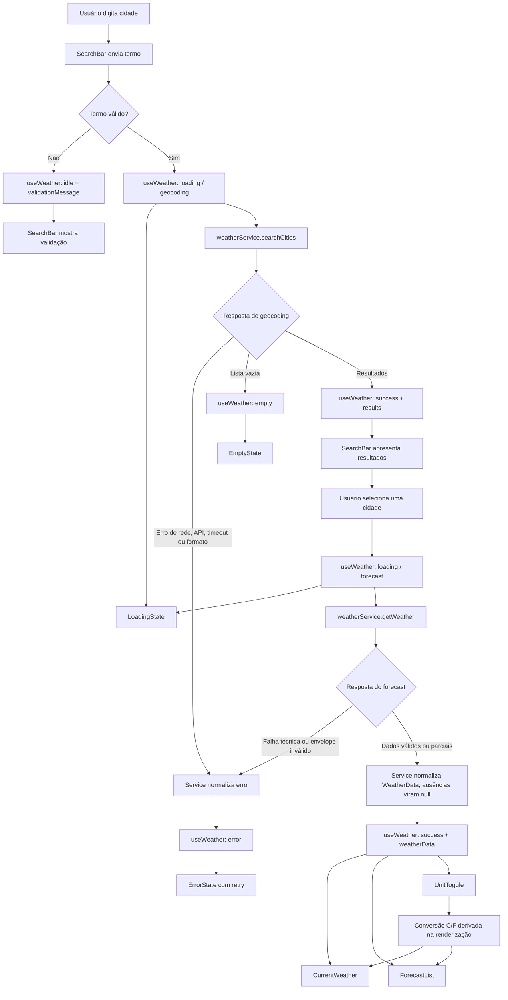

# Plano Técnico — Weather App

## Architecture

A aplicação será uma SPA React dividida em quatro responsabilidades simples:
apresentação, estado da experiência, acesso à API e funções puras de domínio.
O fluxo principal será:

1. `SearchBar` recebe o texto da cidade.
2. `useWeather` coordena a busca e os estados da tela.
3. `weatherService` consulta a Open-Meteo e transforma respostas externas em
   contratos internos.
4. `App` compõe os componentes de busca, clima atual, previsão e unidade.
5. `lib/` concentra formatação, conversão de temperatura e mapeamento de
   códigos meteorológicos.

A camada de UI não conhecerá URLs ou formatos brutos da API. O service valida e
normaliza as respostas antes de expô-las ao hook. A aplicação não terá backend
próprio, autenticação, cache compartilhado ou estado global: o escopo é uma
consulta por sessão, conforme a spec.

```text
Usuário
  |
  v
SearchBar --> useWeather --> weatherService --> Open-Meteo
                |                  |
                v                  v
             estado             dados normalizados
                |
                v
 App --> CurrentWeather + ForecastList + UnitToggle + estados
```

## Tech Stack

- **TypeScript strict:** tipos compartilhados e contratos explícitos entre as
  camadas.
- **React + Vite:** SPA leve, com desenvolvimento rápido e build estático.
- **Tailwind CSS:** estilos responsivos e consistentes com o tema do projeto.
- **Vitest + Testing Library:** testes unitários e de componentes, priorizando
  comportamento observável.
- **Playwright:** testes E2E dos fluxos críticos em desktop e mobile.
- **Biome:** lint e formatação.
- **pnpm:** instalação e execução dos scripts do projeto.
- **Open-Meteo:** geocoding e forecast sem API key para o fluxo definido.

Não será introduzido gerenciador global de estado ou biblioteca de data
fetching. O escopo atual pode ser atendido com estado local no hook principal e
funções assíncronas no service.

## Project Structure

```text
src/
├── components/
│   ├── CurrentWeather.tsx     # clima atual
│   ├── ForecastCard.tsx       # um dia da previsão
│   ├── ForecastList.tsx        # lista de cinco dias
│   ├── SearchBar.tsx           # entrada e envio da busca
│   ├── UnitToggle.tsx          # seleção Celsius/Fahrenheit
│   └── states/                 # loading, erro e vazio
├── hooks/
│   └── useWeather.ts           # orquestração de busca, seleção e estado
├── services/
│   └── weatherService.ts       # Open-Meteo, timeout e normalização
├── lib/
│   ├── format.ts               # datas, números e textos de apresentação
│   ├── temperature.ts          # conversão e arredondamento C/F
│   └── weatherCodes.ts         # mapeamento de códigos para condição/ícone
├── types/
│   └── weather.ts              # contratos compartilhados
├── styles/
│   └── index.css               # estilos globais e Tailwind
├── App.tsx                     # composição da tela
└── main.tsx                    # inicialização do React

tests/
├── unit/                       # funções, service e componentes
├── e2e/                        # fluxos completos no navegador
└── setup.ts                    # configuração dos testes
```

A estrutura segue a convenção do projeto: um componente por arquivo, rede
isolada em `services/`, hooks reutilizáveis em `hooks/`, tipos em `types/` e
funções puras em `lib/`.

## Data Model

Os contratos são o modelo interno independente do formato HTTP da Open-Meteo.
Campos obrigatórios ausentes ou inválidos tornam a cidade não selecionável ou
os dados correspondentes indisponíveis; valores meteorológicos ausentes não
devem ser convertidos em zero.

```ts
type Unit = 'celsius' | 'fahrenheit';
type WeatherStatus = 'idle' | 'loading' | 'success' | 'error' | 'empty';
type OperationPhase = 'geocoding' | 'forecast' | null;

interface City {
  id?: number | string;
  name: string;
  country?: string;
  admin1?: string;
  latitude: number;
  longitude: number;
  timezone?: string;
}

interface CurrentWeather {
  time: string | null;
  temperatureCelsius: number | null;
  weatherCode: number | null;
}

interface ForecastDay {
  date: string;
  minTemperatureCelsius: number | null;
  maxTemperatureCelsius: number | null;
  weatherCode: number | null;
}

interface WeatherData {
  city: City;
  current: CurrentWeather;
  forecast: [ForecastDay, ForecastDay, ForecastDay, ForecastDay, ForecastDay];
  timezone: string;
  fetchedAt: string;
}
```

`City` exige nome não vazio, latitude finita entre -90 e 90 e longitude finita
entre -180 e 180; país e região são opcionais. A
identidade de seleção usa o registro/coordenadas, nunca apenas o nome. O
`WeatherData` sempre contém cinco datas locais; os dados diários podem ser
`null` individualmente. Se temperatura ou condição atual faltar, o cartão
atual representa esses valores como indisponíveis. Unidade é de apresentação;
os dados de origem permanecem em Celsius sem arredondamento. Conversão e
arredondamento de exibição seguem FR-06 e NFR-06.

## Data Flow



A busca de cidade e a consulta de previsão são operações distintas. A previsão
só começa após a seleção explícita de um resultado de geocoding. Reenvio de
termo idêntico enquanto pendente não inicia outra requisição; uma busca
diferente invalida respostas anteriores, que não podem substituir resultados
mais recentes. A seleção de uma nova cidade também invalida forecast anterior.

## External APIs

### Geocoding

- **Endpoint:** `GET https://geocoding-api.open-meteo.com/v1/search`
- **Parâmetros:** `name` recebe o termo não vazio; `count=5` limita os
  resultados; `language=pt` solicita nomes em português; `format=json` define
  resposta JSON.
- **Exemplo resumido de resposta:**

```json
{
  "results": [
    {
      "id": 2267057,
      "name": "Lisboa",
      "latitude": 38.71667,
      "longitude": -9.13333,
      "timezone": "Europe/Lisbon",
      "country": "Portugal",
      "admin1": "Lisboa"
    }
  ]
}
```

- **Mapeamento para `City`:** `id`, `name`, `country`, `admin1`, `latitude`,
  `longitude` e `timezone` mapeiam para propriedades homônimas. `name` deve
  ser não vazio; latitude deve estar entre -90 e 90 e longitude entre -180 e
  180. País e região podem faltar. Descartar itens inválidos; lista `results`
  ausente ou vazia é resultado sem cidades; propriedade `results` presente com
  tipo diferente de array é resposta inválida e produz erro tratável.

### Forecast

- **Endpoint:** `GET https://api.open-meteo.com/v1/forecast`
- **Parâmetros:** `latitude` e `longitude` vêm da cidade selecionada;
  `current=temperature_2m,relative_humidity_2m,weather_code,wind_speed_10m,precipitation`
  solicita as observações atuais; `daily=weather_code,temperature_2m_max,temperature_2m_min,precipitation_probability_max,precipitation_sum`
  solicita os campos diários; `forecast_days=5` representa hoje mais quatro
  dias; `timezone=auto` solicita datas e horários locais da cidade;
  `temperature_unit=celsius` fixa Celsius como unidade de origem.
- **Exemplo resumido de resposta:**

```json
{
  "timezone": "Europe/Lisbon",
  "current_units": {
    "time": "iso8601",
    "temperature_2m": "°C",
    "relative_humidity_2m": "%",
    "weather_code": "wmo code",
    "wind_speed_10m": "km/h",
    "precipitation": "mm"
  },
  "current": {
    "time": "2026-09-30T14:00",
    "temperature_2m": 20.4,
    "relative_humidity_2m": 65,
    "weather_code": 2,
    "wind_speed_10m": 8.5,
    "precipitation": 0
  },
  "daily_units": {
    "time": "iso8601",
    "weather_code": "wmo code",
    "temperature_2m_min": "°C",
    "temperature_2m_max": "°C",
    "precipitation_probability_max": "%",
    "precipitation_sum": "mm"
  },
  "daily": {
    "time": ["2026-09-30", "2026-10-01", "2026-10-02", "2026-10-03", "2026-10-04"],
    "weather_code": [2, 3, 1, 61, 0],
    "temperature_2m_min": [16.1, 15.8, 16.4, 17.0, 16.2],
    "temperature_2m_max": [22.5, 21.0, 23.1, 20.8, 24.0],
    "precipitation_probability_max": [10, 20, 0, 70, 0],
    "precipitation_sum": [0, 0.2, 0, 3.1, 0]
  }
}
```

- **Mapeamento para `CurrentWeather`:** `current.time` → `time`;
  `temperature_2m` → `temperatureCelsius`; `weather_code` → `weatherCode`;
  `is_day` → `isDay` (converter `1/0` para `true/false`);
  `relative_humidity_2m` → `relativeHumidity`; `wind_speed_10m` →
  `windSpeedKmh`; `precipitation` → `precipitationMm`.
- **Mapeamento para `ForecastDay`:** para cada índice `i` de `daily.time`,
  criar um item com `date = time[i]`, `weatherCode = weather_code[i]`,
  `minTemperatureCelsius = temperature_2m_min[i]` e
  `maxTemperatureCelsius = temperature_2m_max[i]`. Mapear também
  `precipitation_probability_max[i]` para `precipitationProbability` e
  `precipitation_sum[i]` para `precipitationMm`.
- **Mapeamento para `WeatherData`:** incluir a `City` selecionada, o objeto
  `CurrentWeather`, os cinco itens `ForecastDay` e `fetchedAt` gerado pelo
  cliente no instante em que a resposta é normalizada. A propriedade
  `timezone` do payload deve ser preservada em `WeatherData.timezone` para
  apresentar `current.time` e as datas no fuso correto; o modelo TypeScript
  precisa declarar essa propriedade.
- **Respostas parciais:** exigir cinco datas válidas. Para um dia com campo
  numérico ou código ausente/nulo, mapear o campo afetado para `null` e manter
  os demais dias. Se temperatura ou código atual estiver ausente, representar
  o campo como `null` para que o cartão atual informe indisponibilidade sem
  eliminar a previsão válida.

Ambos os endpoints são GET públicos e não exigem API key para o uso previsto.
O acesso fica isolado no service. Termos, atribuição e limites de tráfego ainda
precisam ser confirmados antes do lançamento.

## State Management

O estado de busca e clima vive no hook `useWeather`; `App` mantém somente a
unidade de apresentação (`Unit`), iniciada em `celsius`. Componentes filhos
recebem valores e callbacks por props e não fazem chamadas à API nem duplicam
estado derivável.

O hook usa os estados explícitos definidos na spec. `phase` identifica qual
operação está carregando e os dados de busca ficam separados dos dados da
cidade selecionada, para evitar associar um forecast anterior a uma seleção
nova. Contrato conceitual:

```ts
interface WeatherViewState {
  query: string;
  status: WeatherStatus;
  phase: OperationPhase;
  results: City[];
  selectedCity: City | null;
  weatherData: WeatherData | null;
  error: { kind: 'network' | 'timeout' | 'http' | 'invalid'; message: string } | null;
  validationMessage: string | null;
}
```

Transições esperadas: `idle` antes de uma busca; `loading/geocoding` durante a
busca; `empty` se não houver resultados; `success` com resultados selecionáveis
ou dados meteorológicos válidos; `loading/forecast` após selecionar cidade; e
`error` em falha não recuperável daquela operação. `phase` volta a `null` em
estados estáveis. Busca vazia é validação local, permanece sem chamada de rede
e expõe `validationMessage`.

O hook ignora reenvio do mesmo termo normalizado enquanto pendente e usa um
identificador crescente para descartar respostas e erros obsoletos. Busca
diferente substitui a anterior; seleção de outra cidade invalida o forecast
anterior. A preferência de unidade permanece em memória até recarregar a
página; persistência local continua pendente de decisão do produto.

Os dados meteorológicos permanecem em Celsius sem arredondamento. A conversão
é derivada durante a renderização por `convertTemperature(valueCelsius, unit)`
em `lib/temperature.ts`; `CurrentWeather` e `ForecastCard` recebem a unidade e
formatam o valor. A fórmula e arredondamento seguem FR-06/NFR-06. Alternar
unidade não modifica `WeatherData`, não limpa a seleção e não dispara busca ou
forecast.

## Error Handling

| Situação | Tratamento no service/hook | Resultado para a interface |
| --- | --- | --- |
| Entrada vazia ou só com espaços | Validar antes do service; não enviar request. | Manter `idle`, definir `validationMessage` e manter o campo disponível. |
| Geocoding sem resultados | Retornar lista vazia, não lançar exceção. | Definir `empty`, limpar resultados anteriores e oferecer nova busca. |
| Falha de rede | Converter falha de `fetch` em erro tipado `network`. | Definir `error`, encerrar loading, mostrar mensagem e retry manual. |
| Erro HTTP/API, inclusive limite de tráfego | Classificar como `http`; preservar status para diagnóstico interno sem expor payload bruto. | Definir `error`; mensagem neutra de indisponibilidade e retry manual quando recuperável. Sem retry automático. |
| Timeout | Cancelar com `AbortController` após 10 segundos e classificar como `timeout`. | Definir `error`, encerrar loading e oferecer retry manual. |
| JSON/envelope inválido ou datas insuficientes | Validar estrutura e exigir cinco datas locais válidas; classificar falha como `invalid`. | Definir `error`; não apresentar previsão estruturalmente inválida. |
| Forecast parcialmente preenchido | Para cada dia válido, mapear campos ausentes/nulos para `null`; manter os cinco dias. Campos atuais ausentes também são `null`. | Manter `success` se o envelope e as cinco datas forem válidos; mostrar campos faltantes como indisponíveis e preservar os demais valores válidos. |
| Cidade sem nome ou coordenadas válidas | Descartar item de geocoding inválido; país/região ausentes são aceitos. | Mostrar somente resultados selecionáveis; se nenhum restar, usar `empty`. |
| Busca/seleção substituída por operação mais recente | Deduplicar termo idêntico pendente e ignorar respostas/erros com identificador obsoleto. | Não deixar resposta antiga ou erro obsoleto sobrescrever o estado atual. |

Erros técnicos não devem expor detalhes internos da API ao usuário. Erros e
loading precisam de texto/semântica acessível. Toda requisição tem limite de 10
segundos; novas tentativas são manuais e não há cache ou fallback offline no
escopo atual.

## Testing Strategy

### Vitest e Testing Library

- **Funções puras (`lib/`):** cobrir `celsiusToFahrenheit`,
  `fahrenheitToCelsius`, `convertTemperature` e `roundTemperature` com valores
  positivos, negativos, zero e empates; confirmar `0 °C = 32 °F`. Testar também
  formatação pt-BR de temperatura/data e códigos WMO conhecidos/desconhecidos.
- **Services (`services/`):** substituir `fetch` por mocks e verificar URL,
  parâmetros e normalização. Cobrir geocoding com sucesso, lista vazia, país
  ausente e item inválido; forecast completo e parcial; HTTP 4xx/5xx, falha de
  rede, timeout, JSON inválido e menos de cinco datas. Nenhum teste chama a API
  real.
- **Hook (`hooks/`):** mockar os services e verificar transições
  `idle → loading → success/empty/error`, validação local sem request, seleção,
  retry manual, deduplicação e descarte de respostas fora de ordem (AC-01.2,
  AC-08.1–AC-09.2, AC-10.2–AC-10.3).
- **Componentes (Testing Library):** testar comportamento acessível nos estados
  `idle`, `loading`, `success`, `empty` e `error`; verificar seleção por
  teclado, mensagens, loading/retry, dados parciais e unidade ativa. A troca
  C/F deve atualizar clima atual e previsão sem nova chamada de service
  (AC-04.1, AC-05.1–AC-05.3, AC-06.1–AC-07.2, AC-10.1).
- Preferir `getByRole`, `getByLabelText` e asserções sobre texto/estado
  observável; não testar classes, estado interno do React ou detalhes de
  implementação.

### Playwright

- Interceptar Open-Meteo com `page.route` e fixtures determinísticas; não usar
  rede externa.
- Cobrir o fluxo principal: buscar cidade, distinguir/selecionar resultado,
  carregar clima atual e cinco dias e alternar C/F sem novo forecast
  (AC-01.1, AC-02.1–AC-03.2, AC-04.1, AC-05.1–AC-06.3, AC-07.1).
- Cobrir busca vazia/sem resultados, erro de rede/API, timeout e retry manual
  (AC-01.2, AC-08.1–AC-09.2), além de loading e prevenção de ações repetidas
  (AC-10.1–AC-10.3).
- Executar fluxos funcionais em viewport mobile de 320 px e desktop de 1440 px;
  usar 768 px como verificação intermediária de layout conforme NFR-01.
- Verificar nomes acessíveis e navegação por teclado nos controles principais.
  A matriz completa de navegadores NFR-09 é um smoke gate de release quando a
  infraestrutura oferecer esses browsers, não precisa multiplicar cada teste
  funcional por toda a matriz.

Os testes não devem chamar a Open-Meteo real. A rede será substituída por mocks
ou rotas controladas para que cada teste tenha resultado determinístico.

## Risks & Trade-offs

| Decisão | Alternativas consideradas | Trade-off e escolha |
| --- | --- | --- |
| Open-Meteo direto do cliente | Backend/proxy próprio ou outro provedor | Direto reduz infraestrutura e não exige chave para o uso previsto, mas aumenta dependência do provedor e expõe o IP/termo de busca ao endpoint. Usar direto no MVP, isolado em `weatherService`; confirmar termos, atribuição e limites antes de produção. |
| Estado em `useWeather` | Estado global (Context/Redux) ou biblioteca de fetching | Hook local é simples para uma tela e fácil de testar; estado global/cache adicionaria abstrações sem necessidade atual. Adotar hook e props; reavaliar se surgirem múltiplas telas ou compartilhamento de dados. |
| Celsius como unidade de origem | Solicitar/armazenar uma cópia em cada unidade | Um valor canônico evita divergência e permite troca instantânea; exige conversão/formatting na UI. Manter Celsius e derivar Fahrenheit na renderização. |
| Cinco dias diários | Previsão horária ou intervalo configurável | Diário é mais simples de escanear e atende ao briefing; não resolve análise intradiária. Manter hoje + quatro dias; deixar horário fora do escopo. |
| Sem persistência no servidor e unidade em memória | Login/histórico ou salvar preferência local | Evita dados de conta e backend; unidade retorna a Celsius após reload. Não adicionar persistência até decisão explícita de produto. |
| Retry manual | Retry automático com backoff ou cache offline | Retry manual evita repetição e tráfego sem controle, mas exige ação do usuário e não mostra dado offline. Usar tentativa manual; não implementar cache/fallback offline no MVP. |
| Mocks em testes, rede real só fora dos testes | Testes unitários/E2E chamando Open-Meteo | Mocks deixam os cenários rápidos, determinísticos e sem dependência de rede; não detectam sozinhos mudanças reais do provedor. Usar mocks nos testes e reservar smoke/validação externa para release. |
| `null` em campos de resposta parcial | Rejeitar a resposta completa ou preencher com zero | Rejeitar tudo perde dados válidos; zero inventa dado. Manter cinco datas, usar `null` e exibir indisponibilidade por campo. |
| Sem biblioteca de cache/fetching | TanStack Query/SWR | Evita dependência e configuração para um fluxo pequeno; exige controlar timeout, deduplicação e respostas obsoletas no hook/service. Manter solução local com testes explícitos. |
| Matriz E2E enxuta e smoke por browser | Rodar toda a suíte em cada browser/viewport | Cobertura completa cruzada eleva custo e duração. Executar cenários críticos em mobile/desktop e smoke da matriz NFR-09 no gate de release. |

O plano mantém como decisões pendentes da spec: persistência local de unidade,
aceitação do orçamento de performance/SLO e confirmação dos termos/limites da
Open-Meteo. Mudanças nessas decisões podem alterar estado, operação ou
arquitetura; não bloqueiam a implementação local com as escolhas provisórias
acima, mas bloqueiam a aprovação para lançamento em produção.
